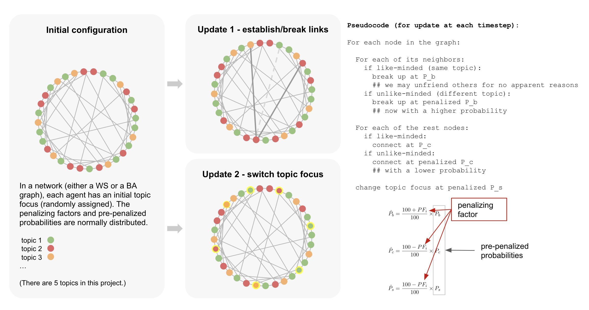

## How Context Mobility Might Shape Online Discussion Agenda
### Using Agent-Based Models to Simulate Topic Community Formation

This repository contains the code for my agent-based modeling (ABM) project, a project that simulated the process of online community formation in a multi-class topic space, and examined how users’ context mobility and bias against unlike-minded others can affect the community structure. The modeling results from two theoretical networks shows that a crowd with higher context mobility is likely to form less stable and looser interest-based communities, and a higher level of discrimination against unlike-minded users will result in better and clearer partitions. The model also reveals that community strength responds differently to the change of probabilities of breaking/connecting at different stickiness level of current connections.

_For more details please refer to 530_project_report.pdf._

